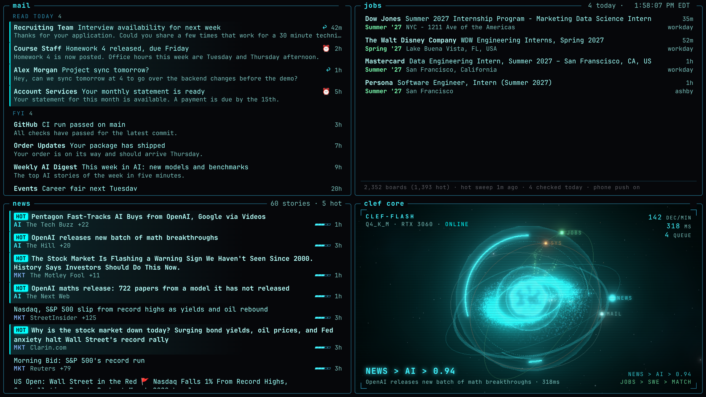
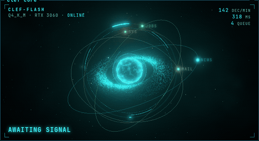
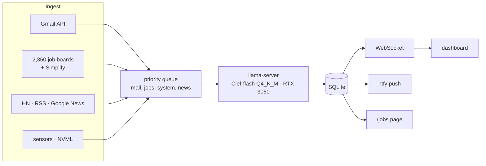

# Clef

**A local AI decision engine for my homelab.** An open-source decision model running on a laptop GPU triages my
inbox, filters market / AI / startup news, watches 2,300+ company job boards for internships, and pushes matches
to my phone within minutes of them going live. Everything runs on one always-on laptop, and every API it uses is free.



<sub>Mail shows demo data; the news and job matches are real output from the running system.</sub>

## Why a decision model

[Clef-flash](https://huggingface.co/ggml-org/Clef-Flash-GGUF) is an open (Apache 2.0) *System One* model: it doesn't
write text. You give it a state and typed questions (`choice`, `score`, or `noul` yes/no) and it returns
structured answers with probabilities in one forward pass. That makes it a good brain for a stream of small
decisions: about **320 ms per decision** on an RTX 3060 laptop GPU, and 200+ decisions a minute.

```jsonc
// POST /v1/systemone (llama.cpp)
{
  "state": { "headline": "Nvidia shares jump 6% after earnings beat", "outlet": "Reuters", "published": "12 minutes ago" },
  "questions": {
    "category":  { "type": "choice", "criteria": { "stocks": "...", "ai": "...", "startups": "...", "irrelevant": "..." } },
    "relevance": { "type": "score",  "criteria": ["not relevant", "slightly", "relevant", "very relevant", "must read"] },
    "breaking":  { "type": "noul",   "instructions": "Is this breaking news?" }
  }
}
// → category: stocks (0.97) · relevance: 2.2 / 4 · breaking: 0.64
```

## What it does

| Panel | Source | What Clef decides |
|---|---|---|
| **Mail** | Gmail API (read-only) | `read_today` / `fyi` / `ignore`, expects a reply?, deadline in the next 3 days?, one-time code? |
| **Jobs** | ~2,350 Greenhouse, Lever, Ashby, SmartRecruiters and Workday boards + SimplifyJobs | Internship or not, role (SWE, AI/ML, data, infra, quant, frontend…), term, US, bachelor's eligible |
| **News** | Hacker News, RSS, Google News, Finnhub | Topic, relevance, breaking, and whether it's the same story as an earlier headline |
| **Core** | Every event above | Nothing: it visualizes the decisions as they happen |
| *(no panel)* | GPU, CPU, RAM, fans, battery | Is something actually wrong? Alerts only on sustained problems, pushed to the phone |

<p align="center"></p>

The core is a small Three.js scene in space: a plasma core with an atmosphere glow inside a Keplerian accretion
disk (thousands of particles, inner ones orbit faster), gyroscope rings, a starfield and faint nebula, and one
orbiting moon per source (mail, news, jobs, system). Data streams leave the source's moon and arc into the core.
Each real decision fires a shockwave sphere and a disk ripple in the source's color, and items that make it onto
the dashboard stream back out to their moon. Without events it only breathes while the camera drifts.

### Job watcher

The point is to apply in the first few minutes, so only sources that show new postings fast are used:

- **Company job boards, polled directly.** The board list is mined daily from SimplifyJobs' 17k internship listings:
  every board that has ever posted an internship. Boards with an internship in the last 120 days are polled every
  3 minutes, the rest every 15. ETags make unchanged boards a free `304`.
- **SimplifyJobs `listings.json`** (refreshes every ~30 min) as a catch-all for custom career sites.
- **Only new postings alert.** The first look at a board records what's there silently; after that a posting alerts
  only if it's new since the last check *and* fresh by its own timestamp.
- Matches push to the phone through [ntfy](https://ntfy.sh) (tap opens the posting), show in the Jobs panel, and on
  `/jobs`, a plain list for any other device on the tailnet.

## Architecture



- **`clef-llama`**: llama.cpp `llama-server` with the SystemOne endpoint. A request evaluates as one sequence, so
  a single worker drains a priority queue.
- **`clefd`**: Python (FastAPI, asyncio). Ingest loops, the decision queue, SQLite, and a WebSocket that streams
  every ingest and decision to the browser. Both run as systemd user services and restart on crash.
- **Dashboard**: vanilla JS modules, no build step. Three.js is vendored.

## Engineering notes

**Fitting a 9B model in 6 GB of VRAM.** The official Q4_K_M is 6.49 GB. But Clef's decision head reads hidden
states, so the 0.78 GB vocabulary head (`output.weight`) is dead weight on the GPU:

| Config | VRAM | p50 latency |
|---|---|---|
| Everything on GPU, `-ub 4096` | out of memory | – |
| `-ot "output\.weight=CPU" -ub 2048` | 5.3 GB | 329 ms |
| `-ot "^output\.weight$=CPU" -ub 2048` | **5.5 GB** | **316 ms** |

The unanchored regex also matched the eight `attn_output` tensors and quietly moved them to RAM. Anchoring it
put them back on the GPU.

**Same-story dedupe with the model.** Fuzzy matching catches identical headlines but not "OpenAI drops 700
preprints" vs "OpenAI releases findings on 377 math problems". When a headline loosely resembles recent ones,
those headlines become options in a `same_story` choice question on the same request. Merged copies count as
extra outlets, which feeds the "hot" ranking.

**Plain language beats raw numbers for health checks.** Given raw sensor JSON, the model called a sustained 91 °C
GPU, a RAM leak and a stuck queue "fine". Given code-computed observations ("GPU 91 °C, 5-min avg 87 °C (normal
under 85 °C), up 15 °C in 10 min. ABOVE NORMAL") it flagged all five injected faults (overheating GPU, RAM leak, stuck queue, unplugged, dead fans) and stayed quiet on normal. It also flagged a short CPU burst once, which is why
alerts need two consecutive bad checks. A few hard limits fire regardless.

**Things that broke in production:** a single interpreter exception silently killed the decision loop (fixed with
per-item isolation, plus the process exits so systemd restarts it if a background loop ever dies); on battery the
GPU is power-capped and decisions slowed 25×, so timeouts and per-item retry caps matter; emails tokenize at
2.8 to 3.7 chars/token, so oversized states are shrunk by the exact overshoot the server reports.

## Setup

Built for an always-on Arch Linux laptop ([Omarchy](https://omarchy.org)/Hyprland) with an NVIDIA GPU (6 GB+).
The backend and dashboard run anywhere with Python and a browser; `bin/clef` and the fan reader are
Hyprland- and Clevo-specific.

```bash
git clone https://github.com/NikhileshThiru/clef ~/projects/clef && cd ~/projects/clef
sudo ./scripts/setup-system.sh          # CUDA, cmake, ninja, uv; lid close does nothing; never suspend

# llama.cpp with SystemOne support (v0.6.0+), CUDA for an RTX 30-series GPU
git clone --depth 1 --branch v0.6.0 https://github.com/ggml-org/llama.cpp ~/.local/src/llama.cpp
cmake -S ~/.local/src/llama.cpp -B ~/.local/src/llama.cpp/build -G Ninja -DGGML_CUDA=ON \
  -DCMAKE_CUDA_ARCHITECTURES=86 -DCMAKE_CUDA_HOST_COMPILER=/usr/bin/g++-15 -DCMAKE_BUILD_TYPE=Release
cmake --build ~/.local/src/llama.cpp/build --target llama-server

# model
mkdir -p ~/.local/share/clef/models
curl -L -o ~/.local/share/clef/models/Clef-Flash-Q4_K_M.gguf \
  https://huggingface.co/ggml-org/Clef-Flash-GGUF/resolve/main/Clef-Flash-Q4_K_M.gguf

uv sync
echo "NTFY_TOPIC=clef-$(openssl rand -hex 16)" >> .env    # subscribe to this topic in the ntfy app
ln -s "$PWD"/systemd/*.service ~/.config/systemd/user/ && systemctl --user daemon-reload
systemctl --user enable --now clef-llama clefd
ln -s "$PWD/bin/clef" ~/.local/bin/clef
```

The systemd units assume the repo lives at `~/projects/clef`; edit `WorkingDirectory`/`ExecStart` if not.

- **Gmail:** create a Google Cloud project, enable the Gmail API, create a *Desktop app* OAuth client, save its
  JSON as `~/.local/share/clef/gmail_client.json`, then run `uv run python -m clefd.gmail_auth`. An unpublished
  ("Testing") app's login expires every 7 days, so Clef pushes a reminder the day before.
- **Finnhub** (optional): `FINNHUB_API_KEY=...` in `.env`.
- **Fan readings** (optional, Clevo/TUXEDO chassis): `sudo ./scripts/setup-fans.sh` installs a sandboxed root
  helper that only reads fan duty.
- `scripts/bench_clef.py` measures latency and VRAM against the running server.

## Use

```bash
clef            # open the dashboard (starts the services if they're down)
clef status     # services, model, queue, health, gmail
clef restart    # restart clefd + clef-llama
clef logs       # follow logs
```

`http://localhost:8077` is the dashboard, and `http://<tailscale-name>:8077/jobs` is the job list from other devices.
`clefd` listens only on loopback and the Tailscale address.

## Configuration

All config files reload on save.

| File | What's in it |
|---|---|
| `config/sources.toml` | News feeds, Google News queries, the reader profile, relevance threshold |
| `config/mail.toml` | Mail profile, lookback, read-today confidence cutoff, stale-code window |
| `config/jobs.toml` | Candidate profile, accepted roles and terms, thresholds, freshness windows, poll cycles, extra boards |
| `.env` | `NTFY_TOPIC` (secret), optional `FINNHUB_API_KEY` |

`CLEF_DEMO=1` serves an existing database without polling anything (that's how the screenshot was made).

## Layout

```
clefd/            backend: app.py (FastAPI + WebSocket), decider.py (queue → llama-server), db.py
  ingest/         news.py, mail.py, jobs.py, system.py: each defines its questions + interpreter
web/              dashboard (index.html, panels/*.js, style.css), jobs.html, vendored three.js
config/           TOML config
systemd/          clef-llama + clefd user units
system/           root fan-reader helper + unit
scripts/          setup-system.sh, setup-fans.sh, bench_clef.py
bin/clef          launcher
```

## Credits

[llama.cpp](https://github.com/ggml-org/llama.cpp) ·
[Clef-Flash GGUF](https://huggingface.co/ggml-org/Clef-Flash-GGUF) ·
[Three.js](https://threejs.org) ·
[SimplifyJobs](https://github.com/SimplifyJobs/Summer2027-Internships) ·
[ntfy](https://ntfy.sh) ·
[Hacker News API](https://github.com/HackerNews/API)

## License

[MIT](LICENSE)
